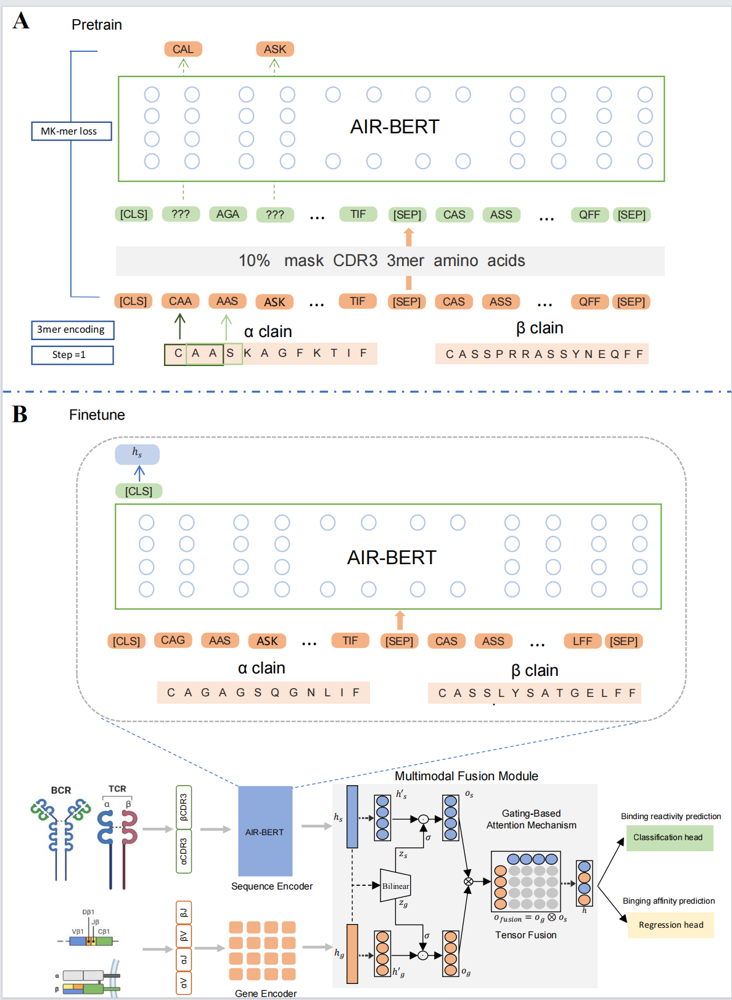

The in silico prediction of antigen binding in adaptive immune receptors (AIRs), which include T-cell receptors (TCRs) and B-cell receptors (BCRs), encompassing both antigen-binding specificity and affinity, remains at the forefront of understanding immunological processes and formulating targeted therapies. The V(D)J gene rearrangement is crucial in diversifying amino acid (AA) sequences in antigen-binding regions, equipping AIRs to discern a plethora of antigens from varied pathogens and the "altered self cells" manifest in cancers. The profound diversity of AIRs brings significant challenges to modern computational techniques aiming for  AIR antigen-binding characteristics analysis. While the latest single-cell technologies can concurrently capture AIR sequences and their corresponding V(D)J gene data, there exists a gap in sophisticated multimodal computational strategies to holistically integrate these datasets for enhanced representations. Addressing these challenges, we introduce Multimodal-AIR-BERT, a novel multimodal pre-trained model tailored to enhance both specificity and affinity predictions in AIRs. This model incorporates a pre-trained sequence encoder, a gene encoder, and a pioneering multimodal fusion module using gating-based attention and tensor fusion. This design ensures a fluid integration of the V(D)J gene and AA sequence traits of AIRs, leading to more enriched representations. In summary, our contribution presents a notable advancement in the field of AIR antigen-binding characteristics analysis. As the accuracy of these predictions improves, it holds the potential to enable precise immune therapies and a deeper understanding of the immune system's complexities.

### Python dependencies
`M-AIR-BERT` mainly depends on the Python scientific stack.   <br>

+ The important packages including:
```
    numpy==1.18.5
    pandas==1.1.5
    torch==1.7.0+cu101
    torchaudio==0.7.0
    torchvision==0.8.1+cu101
    scikit-learn==0.23.2
```

Runing

(1) pre-training

    python3 ./code/bert/main_mlm.py \
    --train_dataset ./data/pretrain/10x-NPC-IBD-IEDB-VDJDB_ab/3mer_8_2/train.tsv \
    --test_dataset ./data/pretrain/10x-NPC-IBD-IEDB-VDJDB_ab/3mer_8_2/test.tsv \
    --vocab_path ./data/vocab/vocab_3mer.pkl \
    --output_path ./result/pretrain \
    --seq_len  79 \
    --num_workers 32 \
    --embedding_mode normal \
    --lr 0.0001 \
    --epochs 50 \
    --hidden 512 \
    --layers 6 \
    --attn_heads 4 \
    --batch_size 16 \
    --prob 0.1 \
    --process_mode MLM

The pretrained model is given in : `./checkpoint/pretrain_models/ab_3mer_len79.ep28`

(2)finetune

bash ./code/finetune.sh
